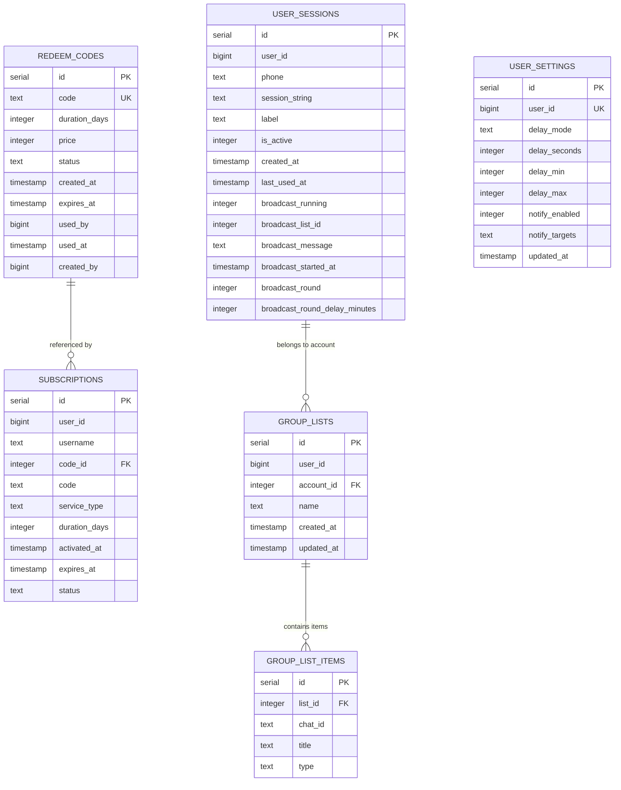
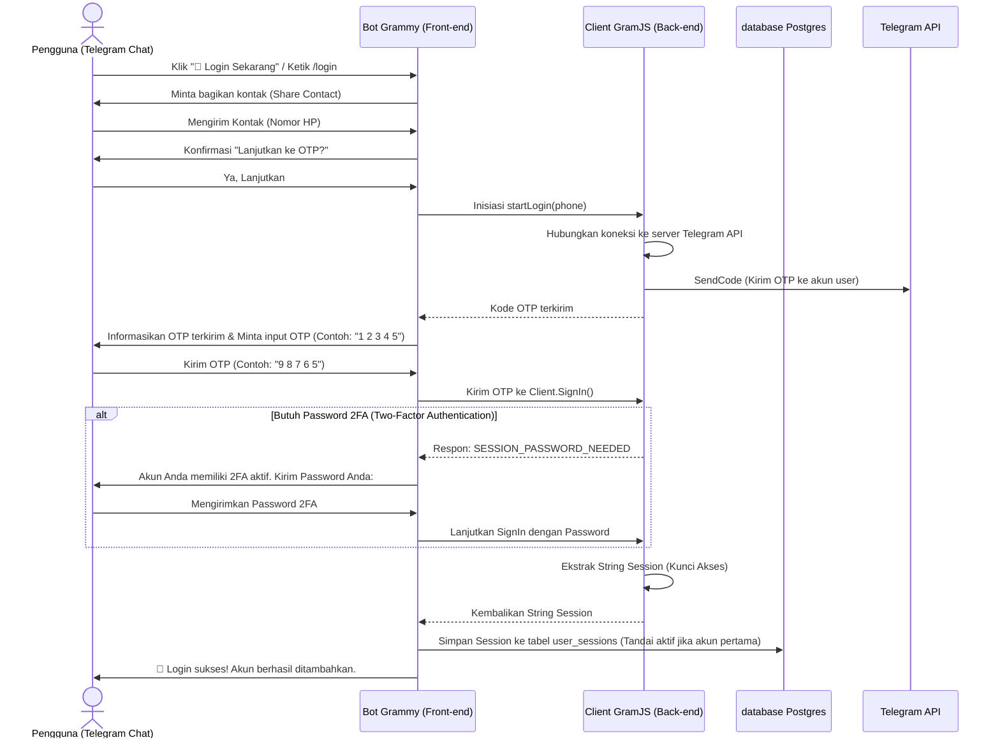
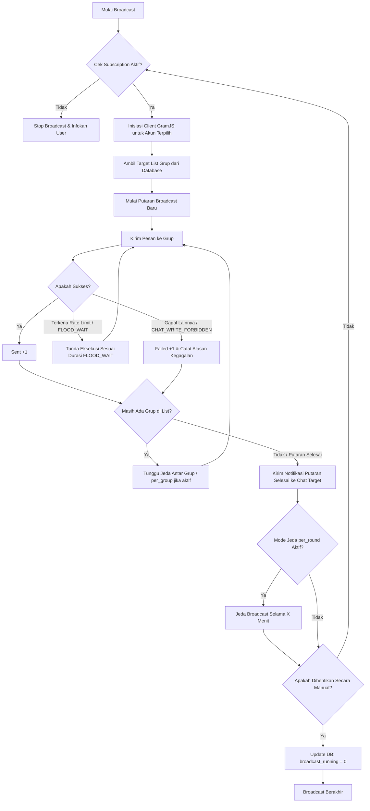

# 🤖 BOT-TELE-JASEB-KIRO: Analisis & Ringkasan Komprehensif Proyek

Proyek **BOT-TELE-JASEB-KIRO** adalah aplikasi Telegram Bot + Userbot (Hybrid) berbasis Node.js yang ditulis menggunakan TypeScript. Aplikasi ini berfungsi sebagai sistem **Jasa Sebar (Broadcast) & Sewa Jasa** yang memungkinkan pengguna untuk menghubungkan banyak akun Telegram pribadi mereka (Userbot) secara instan, mengelola daftar grup, dan menyebarkan pesan iklan/promosi secara otomatis selama 24 jam dengan jeda waktu yang aman. Proyek ini dilengkapi dengan sistem lisensi berbasis **Kode Redeem & Berlangganan (Subscription)** untuk monetisasi layanan.

---

## 📊 Ringkasan Informasi Proyek

| Kategori | Deskripsi |
| :--- | :--- |
| **Nama Bot** | Bot Jasa Sebar (Sewa Jasa & Jasa Sebar) |
| **Stack Utama** | Node.js, TypeScript, PostgreSQL |
| **Bot API Framework** | **Grammy** (untuk antarmuka Bot Interaktif) |
| **MTProto Client Library** | **GramJS** / `telegram` (untuk otomatisasi Userbot/akun pribadi) |
| **Database ORM** | **Drizzle ORM** |
| **Database Driver** | `pg` (`node-postgres` Connection Pool) |
| **Runtime / Transpiler** | `tsx` (TypeScript Execute), `tsc` (TypeScript Compiler) |
| **Sistem Lisensi** | Kode Redeem 9-karakter alfanumerik unik |

---

## 🛠️ Arsitektur Direktori & Struktur File

Berikut adalah struktur lengkap dari proyek ini berserta peran dari masing-masing file:

```markdown
BOT-TELE-JASEB-KIRO/
├── 📁 data/                        # Penyimpanan data lokal / database SQLite (jika ada/opsional)
├── 📁 node_modules/                # Dependensi proyek npm
├── 📁 src/                         # Kode Sumber Utama
│   ├── 📁 db/                      # Modul Database & Schema ORM
│   │   ├── 📄 index.ts             # Inisialisasi Postgres Connection Pool & Drizzle
│   │   └── 📄 schema.ts            # Definisi Tabel Database, Tipe data, Relasi, dan Indeks
│   ├── 📁 services/                # Logika Bisnis & Layanan Inti
│   │   ├── 📄 broadcast.ts         # Logika pengiriman pesan berulang, delay, dan notifikasi
│   │   ├── 📄 gramjs.ts            # Manajemen client GramJS, login OTP/2FA, multi-account, scan grup
│   │   ├── 📄 groupList.ts         # Layanan pengelolaan database list grup pengguna
│   │   ├── 📄 redeem.ts            # Layanan pembuatan & manajemen status kode redeem
│   │   ├── 📄 subscription.ts      # Layanan pelacakan masa aktif (subscription) & redeem
│   │   └── 📄 userSettings.ts      # Layanan pengaturan jeda (delay) dan notifikasi broadcast
│   ├── 📁 bot/                     # Antarmuka Grammy Telegram Bot
│   │   ├── 📁 middlewares/         # Middleware Bot (seperti autentikasi hak akses admin)
│   │   │   └── 📄 auth.ts          # Middleware pembatasan akses khusus ADMIN
│   │   ├── 📁 keyboards/           # Penyusunan Antarmuka Keyboard Bot
│   │   │   ├── 📄 admin.ts         # Keyboard menu admin (Generate, List Kode, Statistik)
│   │   │   └── 📄 user.ts          # Keyboard menu user (Login, Scan, Dashboard)
│   │   ├── 📁 commands/            # Handler Perintah Bot
│   │   │   ├── 📁 admin/           # Folder Perintah Admin
│   │   │   │   ├── 📄 generate.ts  # Handler pembuatan kode redeem baru
│   │   │   │   ├── 📄 listcodes.ts # Handler melihat / memfilter daftar kode redeem
│   │   │   │   └── 📄 index.ts     # Pendaftaran seluruh perintah admin
│   │   │   └── 📁 user/            # Folder Perintah & Navigasi Pengguna
│   │   │       ├── 📄 sewa_jasa.ts # Handler login akun user, OTP, 2FA, & scan grup
│   │   │       ├── 📄 groups.ts    # Handler manajemen list grup (scan, simpan list, lihat list)
│   │   │       ├── 📄 broadcast.ts # Handler memulai & mengonfirmasi broadcast
│   │   │       ├── 📄 broadcast_status.ts # Handler pemantauan progress broadcast real-time
│   │   │       ├── 📄 control.ts   # Handler kontrol multi-akun & penggantian akun aktif
│   │   │       ├── 📄 join_groups.ts # Handler otomatisasi join grup via link / username
│   │   │       ├── 📄 notify.ts    # Handler pengaturan tujuan notifikasi broadcast
│   │   │       ├── 📄 settings.ts  # Handler pengaturan jeda (delay) antar grup/putaran
│   │   │       ├── 📄 status.ts    # Handler melihat sisa waktu berlangganan
│   │   │       ├── 📄 endsub.ts    # Handler pemutusan langganan & logout akun
│   │   │       └── 📄 index.ts     # Pendaftaran seluruh perintah user
│   │   └── 📄 index.ts             # Titik masuk utama Bot Grammy & inisialisasi Database
│   ├── 📄 config.ts                # Konfigurasi & validasi variabel lingkungan (.env)
│   └── 📄 index.ts                 # File inisiasi root
├── 📄 .env                         # Konfigurasi variabel lingkungan (Rahasia/Sensitif)
├── 📄 .gitignore                   # Daftar berkas yang diabaikan oleh Git
├── 📄 drizzle.config.ts            # Konfigurasi drizzle-kit untuk migrasi database
├── 📄 package.json                 # Metadata npm, daftar dependensi, & script command
├── 📄 tsconfig.json                # Konfigurasi kompilator TypeScript
└── 📄 projek.md                    # Ringkasan Analisis Proyek (File ini)
```

---

## 🌟 Fitur-Fitur Utama Proyek

### 1. 🔑 Sistem Lisensi Berlangganan (Subscription & Redeem Code)
*   **Generate Lisensi**: Admin dapat membuat kode lisensi acak (9 karakter alfanumerik aman dari ambiguitas) melalui menu `/generate` dengan durasi dan masa kedaluwarsa tertentu.
*   **Pemetaan Harga**:
    *   **1 Hari** : Rp3.000
    *   **4 Hari** : Rp10.000
    *   **7 Hari** : Rp16.000
    *   **15 Hari** : Rp30.000
    *   **30 Hari** : Rp50.000
*   **Aktivasi & Perpanjangan**: Pengguna menukarkan kode redeem untuk mengaktifkan status berlangganan. Jika lisensi aktif masih ada, waktu lisensi baru akan diakumulasikan secara otomatis (**Perpanjang/Extend**).
*   **Auto-Expiration**: Aplikasi secara berkala mengecek lisensi yang sudah melewati masa kedaluwarsa dan mengubah statusnya menjadi `expired`.

### 2. 👥 Manajemen Multi-Akun Telegram (Multi-Account Userbot)
*   Aplikasi mendukung penyimpanan hingga **10 akun Telegram per user** secara bersamaan.
*   **Alur Login Mandiri**: Pengguna mengirimkan nomor HP, bot mengirimkan OTP resmi Telegram, pengguna memasukkan OTP dengan format aman (memakai spasi: `1 2 3 4 5` agar tidak diblokir/dibaca sebagai kode biasa), serta memasukkan password 2FA (jika aktif).
*   **Manajemen Akun**: Melalui tombol `🎛 Control`, pengguna dapat:
    *   Melihat daftar akun yang terhubung.
    *   Memilih salah satu akun sebagai **Akun Aktif** untuk dieksekusi.
    *   Mengganti label nama akun untuk mempermudah identifikasi.
    *   Melakukan logout / menghapus akun tertentu secara mandiri.

### 3. 🗂️ Manajemen List Grup (Group List Management)
*   **Scan Grup**: Akun userbot aktif memindai semua dialog (grup, supergroup, channel) tempat akun tersebut bergabung (dibatasi 200 dialog teratas untuk efisiensi). Hasil scan dikirim sebagai daftar pesan atau lampiran berkas `.txt` jika jumlahnya melbihi batas karakter Telegram.
*   **Buat List Grup**: Pengguna dapat menyaring grup hasil scan dan menyimpannya sebagai daftar tersendiri (List Grup) dengan nama khusus di database, terisolasi per akun user.
*   **Gabung Grup Massal**: Fitur `🚪 Bergabung Grup` memungkinkan akun userbot untuk bergabung secara otomatis ke daftar tautan grup/channel yang dikirimkan oleh pengguna.

### 4. 📣 Mesin Broadcast Cerdas & Tangguh (Resilient Broadcast Engine)
*   **Pengiriman Pesan**: Menyebarkan pesan promosi ke seluruh grup dalam list grup yang dipilih secara berurutan.
*   **Pengaturan Jeda Kustom**:
    *   `global` / `safe` : Jeda aman default.
    *   `per_group` : Jeda spesifik sekian detik di antara setiap pengiriman ke satu grup.
    *   `per_round` : Jeda dalam menit setelah seluruh grup dalam list selesai dikirimi pesan dalam 1 putaran. Broadcast akan terus berputar secara looping 24 jam non-stop.
*   **Ketangguhan (Error & Rate-Limit Handling)**:
    *   **Flood Wait Tolerant**: Jika terkena rate limit dari Telegram (`FLOOD_WAIT_X`), sistem akan otomatis menjeda proses pengiriman selama `X` detik dan melanjutkannya setelah jeda selesai secara mandiri.
    *   **Penyaring Error**: Error spesifik seperti `CHAT_WRITE_FORBIDDEN` (tidak boleh mengirim pesan), `USER_BANNED_IN_CHANNEL` (di-ban), atau `CHANNEL_PRIVATE` dianalisis dan dicatat ke dalam log progress, sehingga tidak menghentikan keseluruhan alur broadcast.
*   **Auto-Resume setelah Restart**: Jika server bot mati atau direstart, bot akan membaca tabel `user_sessions` dan secara otomatis **melanjutkan (resume)** semua broadcast akun yang sebelumnya sedang aktif berjalan tepat pada putaran terakhir.

### 5. 🔔 Sistem Notifikasi Real-Time
*   Pengguna dapat mengonfigurasi bot untuk mengirimkan laporan setiap kali 1 putaran broadcast selesai.
*   Laporan dikirimkan ke target chat/channel Telegram yang ditentukan oleh pengguna.
*   **Laporan Kegagalan Detail**: Jika terdapat kegagalan pengiriman pada grup, bot melampirkan daftar kegagalan tersebut. Jika lebih dari 10 grup gagal, bot secara cerdas mengemas daftar tersebut ke dalam file teks `.txt` agar chat tetap bersih dan rapi.

---

## 🗄️ Skema Database (PostgreSQL Drizzle Schema)

Berikut adalah visualisasi relasi dan detail struktur kolom dari tabel-tabel database di `src/db/schema.ts`:



### Detail Deskripsi Tabel:
1.  **`redeem_codes`**: Menyimpan lisensi yang digenerate oleh admin.
2.  **`subscriptions`**: Mencatat masa aktif pengguna yang melakukan redeem lisensi. Setiap lisensi dikunci ke satu jenis layanan (`service_type` bernilai `sewa_jasa`).
3.  **`user_sessions`**: Menyimpan string session GramJS untuk login multi-akun, label akun, status keaktifan akun, dan state broadcast spesifik dari akun tersebut (seperti putaran broadcast saat ini, status berjalan, delay, dan pesan).
4.  **`group_lists`**: Menyimpan daftar grup kustom yang dibuat oleh pengguna, dipisahkan berdasarkan akun Telegram (`account_id`).
5.  **`group_list_items`**: Berisi ID grup spesifik, judul grup, dan tipenya (`group`, `supergroup`, atau `channel`) yang tergabung di dalam suatu `group_lists`.
6.  **`user_settings`**: Menyimpan konfigurasi pengguna seperti jeda pengiriman (delay mode & seconds) dan daftar ID chat target notifikasi broadcast.

---

## 🔄 Alur Kerja Utama (Core Workflows)

### A. Alur Login & Hubung Akun Telegram (OTP & 2FA)



### B. Alur Proses Broadcast Berulang 24 Jam



---

## ⚡ Analisis Kualitas & Kunci Keunggulan Codebase

1.  **Hybrid Bot & Userbot System**: Integrasi yang sangat baik antara **Grammy** (sebagai bot interaktif cepat, minim rate limit, sangat responsif) dan **GramJS** (sebagai userbot untuk melakukan tugas-tugas berat yang tidak bisa dilakukan bot API, seperti memindai grup luar dan memposting sebagai user biasa).
2.  **Quiet Logger Custom**: GramJS dikenal sangat berisik (*noisy*) dengan log koneksi internal di terminal. Developer membuat kelas `QuietLogger` di `src/services/gramjs.ts` yang menyaring pesan-pesan tidak penting sehingga mempermudah pembacaan log server dan debugging error krusial.
3.  **Toleransi Tinggi terhadap Kegagalan (High Resilience)**:
    *   **Auto-Resume**: Penggunaan kolom broadcast state langsung pada tabel database `user_sessions` memastikan status broadcast tersinkronisasi di media penyimpanan. Jika bot mengalami *crash* atau server direstart, bot dapat langsung melanjutkan broadcast yang menggantung saat dinyalakan kembali tanpa kehilangan progress putaran terakhir.
    *   **Flood Wait Recovery**: Mengintegrasikan delay adaptif saat menerima error `FLOOD_WAIT` sehingga akun tidak mudah diblokir oleh Telegram.
4.  **Dukungan Multi-Akun**: Mampu memisahkan list grup, status broadcast, dan label secara terpisah per akun Telegram, meskipun dimiliki oleh ID pengguna Telegram yang sama.

---

## 🚀 Saran & Rekomendasi Pengembangan (Future Roadmaps)

> [!TIP]
> Berikut adalah beberapa ide peningkatan performa dan fungsionalitas aplikasi yang dapat diimplementasikan di masa depan:

1.  **Dukungan Media dalam Broadcast**: Saat ini pesan broadcast dikirim sebagai teks biasa. Kolom database `broadcastMessage` sudah dirancang untuk mendukung tipe *text* (tertulis komentar untuk mendukung format JSON di kemudian hari). Fitur pengiriman gambar, video, dan dokumen bisa diaktifkan dengan mengurai JSON media di layanan `broadcast.ts`.
2.  **Sistem Antrean Broadcast (Message Queue)**: Saat ini broadcast berjalan menggunakan Map in-memory dan loop manual. Jika jumlah pengguna meningkat menjadi ratusan dengan ribuan grup, memori server akan terbebani. Menggunakan *queue worker* seperti **BullMQ** berbasis Redis akan membuat broadcast jauh lebih aman, hemat memori, dan mudah dipantau.
3.  **Dukungan Proksi per Akun**: Karena pengguna dapat menghubungkan hingga 10 akun Telegram, menjalankan semuanya dari satu alamat IP server yang sama dapat memicu pemblokiran massal (*mass ban*) oleh Telegram karena dianggap sebagai spamming dari satu IP. Menambahkan opsi konfigurasi proxy (SOCKS5/HTTP) untuk tiap akun di tabel `user_sessions` akan meningkatkan keamanan akun pengguna secara signifikan.
4.  **Web Dashboard Terintegrasi**: Menyediakan antarmuka web modern (menggunakan React atau Next.js) agar pengguna dapat melihat statistik pengiriman, mengedit list grup, dan melacak status lisensi secara visual melalui peramban web selain di Telegram Bot.
